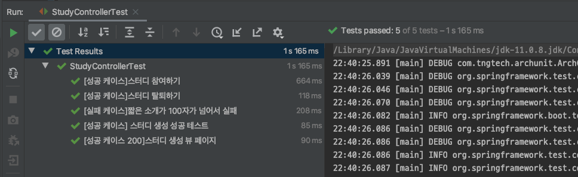
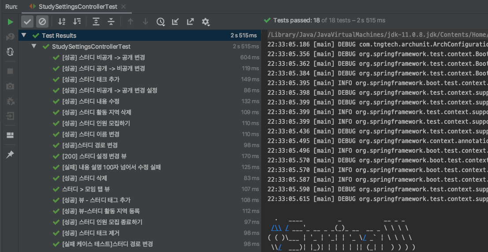
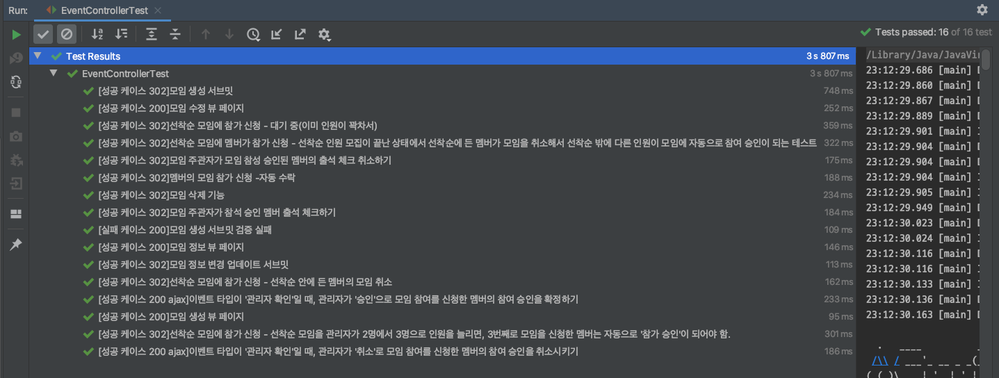
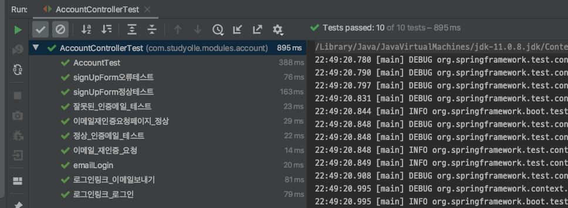
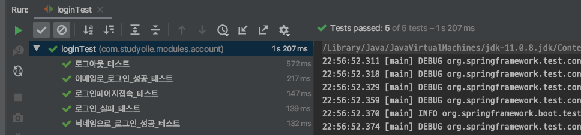
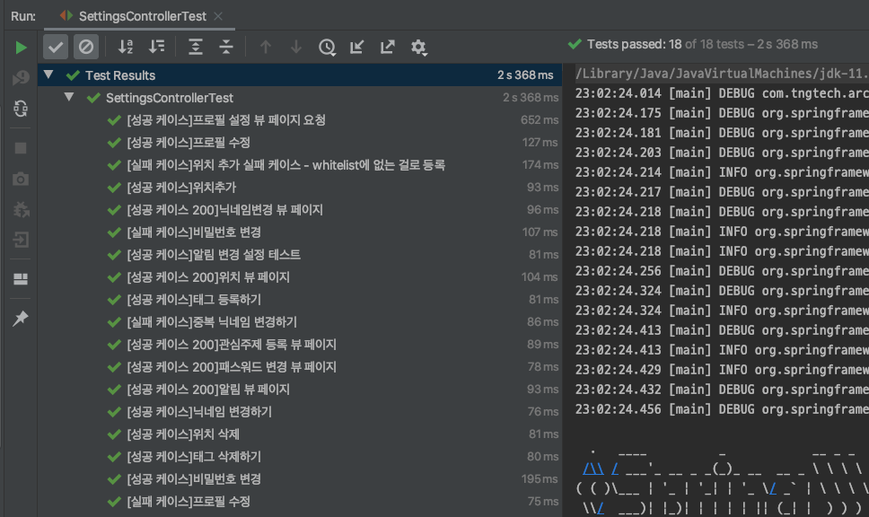

# 스터디 모임 웹 애플리케이션
[인프런](https://www.inflearn.com/) 에서 백기선님의 강의를 들으면서 따라 만든 프로젝트입니다. 이번 프로젝트를 따라 만들면서 아래의 기술들을 익숙하게 사용할 수 있게 되었습니다. 추가적으로 Spring MVC나 JPA의 개념과 원리를 개인적으로 공부할 수 있는 기회가 되기도 했습니다.
공부한 내용은 저의 [블로그](https://pinokio0702.tistory.com/category/SpringBoot) 에 기록하기도 합니다.
## 사용한 기술

- SpringBoot
- JUnit5
- Spring Security
- Java Persistence Api
- PostgresSQl
- Thymeleaf
- IDE : IntelliJ

## Working with StudyMoim in your IDE
### preparation

- Java11


### Steps:

1) IntelliJ로 GitClone하기<br>
`File -> New -> Project from Version Control...`

2) git Url과 pc에 프로젝트를 내려받을 경로 지정

3) npm 내려 받기<br>
터미널에서 `studymoim홈경로/resources/static` 경로로 이동 후, 아래 명령어들을 입력.
    - npm install jquery
    - npm install bootstrap
    - npm install jdenticon
    - npm install font-awesome
    - npm install tagify
    - npm install summernote
4) 초기 Application.properties

    인메모리 데이터베이인 [h2](https://www.h2database.com/html/main.html
)를 사용했습니다.

4) 애플리케이션 실행

    Visit [http://localhost:8080](http://localhost:8080) in your browser.
    


### 단위테스트 개발
스팩<br>
- ```JUnit5```
- ```SpringBootTest``` 
- ```MockMVC```
- ```junit.Assertions```
1. [스터디 생성/참여 기능 테스트]() (5건)
 

2. [스터디정보 설정/삭제 기능 관련 테스트]()(18건)  


3. [모임 기능 관련 테스트](https://github.com/Insookim0702/studyMoim/blob/master/src/test/java/com/studyolle/event/EventControllerTest.java) (18건)


4. `JUnit4` [계정 생성/이메일 인증/이메일 로그인 기능 테스트]() (10건)


5. `JUnit4` [로그인/로그아웃 테스트]() (5건)


6. [계정 정보 설정 기능 테스트]() (18건)



